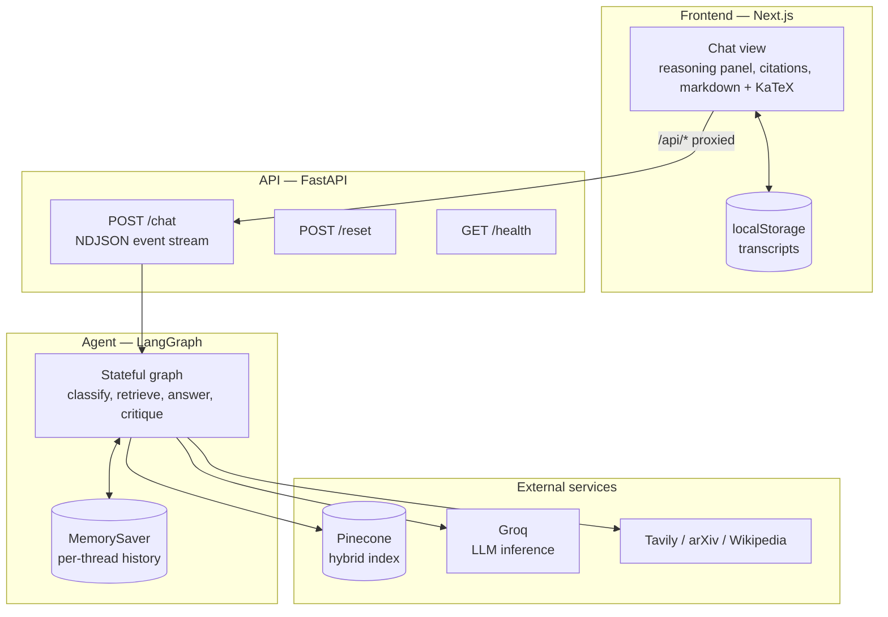
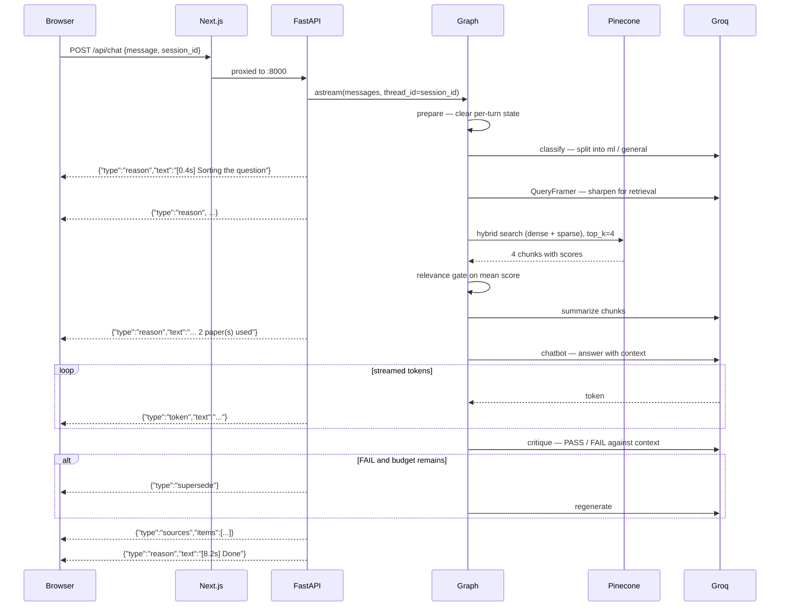
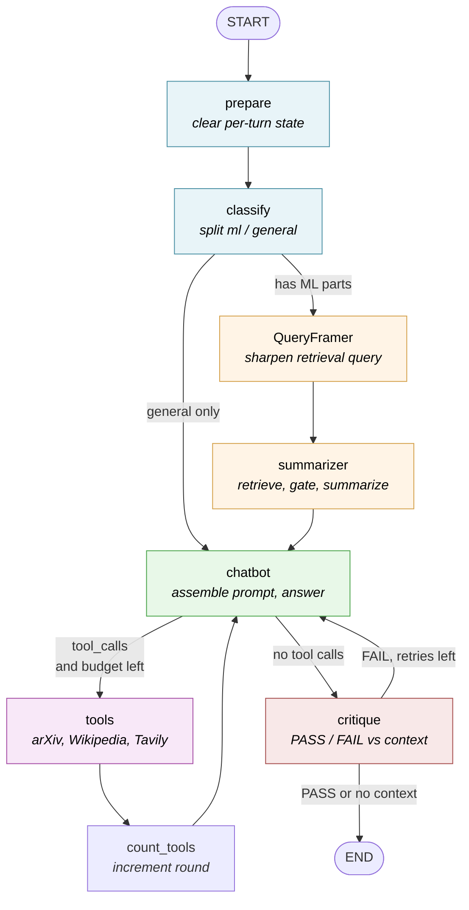
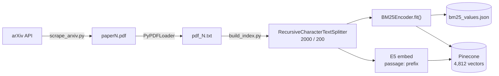

# Design Document

This document records **why** the system is built the way it is. It covers the
constraints that shaped it, the decisions taken, the alternatives rejected and
the trade-offs accepted.

For installation and usage, see [README.md](README.md). That document explains
how to run the system; this one explains how to change it without breaking the
assumptions it rests on.

---

## Contents

1. [Purpose and scope](#1-purpose-and-scope)
2. [Constraints](#2-constraints)
3. [System overview](#3-system-overview)
4. [Request lifecycle](#4-request-lifecycle)
5. [The agent graph](#5-the-agent-graph)
6. [State model](#6-state-model)
7. [Retrieval design](#7-retrieval-design)
8. [Token budget](#8-token-budget)
9. [Design decisions](#9-design-decisions)
10. [Failure modes](#10-failure-modes)
11. [Streaming protocol](#11-streaming-protocol)
12. [Frontend architecture](#12-frontend-architecture)
13. [Data pipeline](#13-data-pipeline)
14. [Testing strategy](#14-testing-strategy)
15. [Known limitations](#15-known-limitations)
16. [Roadmap](#16-roadmap)

---

## 1. Purpose and scope

### What this is

A question-answering assistant over a corpus of 100 arXiv papers on AI and
machine learning, with a conversational interface. It answers research
questions from the indexed corpus with citations, and general questions by
searching external sources.

### What it is not

It is **a single-user research tool**, not a product. That distinction drives
most of the decisions below. There is no authentication, no multi-tenancy, no
database and no deployment story, because none of those serve one person
running it on their own laptop. Effort went into answer quality and graceful
degradation instead.

### Design goals, in priority order

| # | Goal | What it means concretely |
|---|------|--------------------------|
| 1 | **Never invent a citation** | An answer either cites papers that genuinely informed it, or cites nothing |
| 2 | **Always answer something** | A failed lookup degrades to a lesser answer with a notice, never to an error |
| 3 | **Stay inside the free tier** | Every prompt is budgeted so a long conversation cannot exceed the rate limit |
| 4 | **Show the work** | The user sees which path a question took and how long each step cost |
| 5 | **Fail legibly** | Error messages name the actual cause and the actual fix |

Goal 1 is the reason for the relevance gate; goal 2 is the reason for bounded
tools; goal 3 is the reason for character-budgeted trimming. Where goals
conflict, the lower number wins: the system will decline to cite rather than
cite loosely, and will answer without context rather than not answer.

---

## 2. Constraints

These are external facts the design has to accommodate. They are not choices.

### Model provider (Groq, free tier)

- A single request is capped at roughly **8,000 tokens per minute**, and the
  account at **200,000 tokens per day** (as recorded in `src/config.py`).
- Limits are enforced **per model**. This has a non-obvious consequence
  exploited in [section 8](#8-token-budget): splitting work across two models
  splits the rate-limit budget as well as the cost.
- Groq **retires models on short notice**. Every model name is therefore an
  environment variable, not a literal, so a decommissioned model is a config
  change rather than a code change.
- Groq **blocks many VPN, proxy and datacentre IP ranges** with HTTP 403. This
  is indistinguishable from a code fault unless the error message says
  otherwise, so it is special-cased in the API layer.

### Embedding model (E5-large-v2, local)

- Runs on CPU. First use loads the model into memory, which is why the first
  query of a session is noticeably slower than the rest.
- Trained with **asymmetric prefixes** (`query: ` / `passage: `). Omitting them
  measurably degrades retrieval.
- The prefix setting is **baked into the stored vectors**. Changing it requires
  a full index rebuild, and changing it on only one side silently corrupts
  retrieval while appearing to work.

### Vector store (Pinecone serverless)

- Hybrid search requires the `dotproduct` metric. This is not a preference;
  Pinecone rejects sparse vectors on an index built with any other metric.
- Scores are **not calibrated** across queries. A dot product of 0.7 means
  different things for different questions, which is what makes the relevance
  gate delicate. See [decision D4](#d4-gate-relevance-on-the-mean-score).

### Corpus

- 100 papers, roughly 4,812 chunks, fixed at scrape time.
- Text is extracted by PyPDF, which flattens two-column academic layouts
  imperfectly and loses table and equation structure.

---

## 3. System overview

Three layers, each replaceable without touching the others.



### Why the layers are split this way

**The frontend never talks to Pinecone or Groq.** All keys stay server-side.
Next.js rewrites `/api/*` to `127.0.0.1:8000`, so the browser makes same-origin
requests and CORS never enters the picture during development.

**The API layer holds no intelligence.** It translates a graph execution into a
stream of events and maps exceptions onto human-readable messages. All
reasoning lives in the graph. This means the graph can be driven from a script
or a test with no HTTP involved, which is how the reliability tests work.

**The agent layer holds no I/O policy.** It does not know about HTTP status
codes or streaming. It returns state; the API decides how to present it.

---

## 4. Request lifecycle

A research question, end to end:



### Cost of a turn

A full research turn makes **five to eight LLM round trips**:

| Call | Model | Always? |
|------|-------|---------|
| `classify` | utility (20b) | Yes |
| `QueryFramer` | utility (20b) | ML path only |
| `summarizer` | summary (20b) | ML path only, if anything retrieved |
| `chatbot` | chat (120b) | Yes |
| tool rounds | chat (120b) | Up to 3 more |
| `critique` | utility (20b) | Only when context exists |
| revision | chat (120b) | Only on FAIL, at most once |

This is the honest explanation for latency. A simple general question is two
calls and returns in a few seconds; a research question that triggers tool use
and a critique failure can be eight calls. The critique gate
([D8](#d8-gate-the-critique-on-having-context)) exists because an ungrounded
critique was adding a full regeneration for no benefit.

---

## 5. The agent graph



### Node responsibilities

| Node | Responsibility | Why it is separate |
|------|---------------|--------------------|
| `prepare` | Reset `context`, `citations`, `refined_query`, counters | State is checkpointed; without this a follow-up inherits the previous turn's context and a spent critique budget |
| `classify` | Split the message into ML and general sub-questions | One message can ask both kinds; forcing it down one path answers half |
| `QueryFramer` | Rewrite the ML parts as a retrieval query | User phrasing is conversational; vector search wants specific terms |
| `summarizer` | Retrieve, gate on relevance, compress to a summary | Four raw 2,000-char chunks would consume the entire prompt budget |
| `chatbot` | Assemble the system prompt and produce the answer | The single place where the outbound prompt is built |
| `tools` | Execute external lookups | Standard LangGraph `ToolNode` |
| `count_tools` | Increment the tool-round counter | A separate node because `ToolNode` output cannot carry extra state |
| `critique` | Check the answer against retrieved context | Catches unsupported claims before the user sees them |

### Why `count_tools` is its own node

`ToolNode` is a prebuilt that returns only `ToolMessage`s. There is no hook to
merge additional keys into the state update, so the round counter needs a node
of its own on the return edge. The alternative — counting inside `chatbot` by
scanning message history for `ToolMessage`s — was rejected because history is
trimmed, so the count would silently reset mid-conversation.

---

## 6. State model

```python
class State(TypedDict, total=False):
    messages: Annotated[list, add_messages]   # persistent, checkpointed
    citations: List[str]                       # per-turn
    context: str                               # per-turn
    refined_query: str                         # per-turn
    model_fallback: str                        # per-turn
    ml_parts: List[str]                        # per-turn
    general_parts: List[str]                   # per-turn
    critique_count: int                        # per-turn
    tool_rounds: int                           # per-turn
```

### The persistent / per-turn distinction

Only `messages` should survive a turn. Everything else describes *this*
question and must be cleared, which is what `prepare` does.

This was not obvious at first and is worth stating plainly: **LangGraph
checkpoints the entire state**, not just messages. A field left set leaks into
the next turn. The concrete failures this caused were a follow-up question
answering from the previous question's paper context, and a critique budget
that stayed spent for the rest of the session so no answer was ever checked
again.

### What is deliberately *not* in state

**The retrieved context is never appended to `messages`.** It is assembled into
the system prompt inside `chatbot` and discarded. If it were pushed into the
message list, it would be checkpointed and re-sent on every subsequent turn,
and the history budget would be consumed by stale context within two or three
questions.

**The refined query is never pushed into `messages`.** The model must answer
the question the user actually asked, not the rephrasing built for the vector
store. The rephrasing exists only to shape retrieval.

---

## 7. Retrieval design

### Hybrid search

Dense (E5 embeddings) and sparse (BM25) are combined at `alpha = 0.5`.

Dense retrieval handles paraphrase: "how do models avoid forgetting old tasks"
finds papers about catastrophic forgetting without sharing a word with them.
Sparse retrieval handles exact terms: an acronym, a benchmark name or an
author's surname that the embedding model has never seen still matches
lexically. Academic queries contain a lot of the second kind, so neither alone
is sufficient.

### BM25 must be fitted on this corpus

`BM25Encoder().default()` loads generic MSMARCO statistics. Those term
frequencies describe web search queries, not ML papers, where terms like
"gradient" and "transformer" are common rather than rare. The index builder
fits BM25 on the actual corpus and writes `bm25_values.json`; the retriever
loads it and **warns loudly** if it is missing rather than silently falling
back to defaults, because the failure is invisible in the output — retrieval
just gets quietly worse.

The path is defined once in `config.py` as `BM25_PATH` for exactly this reason:
the two halves previously disagreed about where the file lived, so the
retriever fell back to defaults while the builder wrote a file nothing read.

### The relevance gate

An off-topic question still returns its four nearest neighbours. Summarising
those produces a confident answer citing papers that do not support it — the
single worst failure mode available to a RAG system, and a direct violation of
design goal 1.

Two independent gates guard against it:

1. **A score threshold** on the mean retrieval score, before anything looks at
   the documents.
2. **A model-side check** in the summarizer prompt, which returns
   `NOT_RELEVANT` if the excerpts are about a different topic.

Either gate firing drops both the context and the citations. Citations are
emitted **only** when the summary was actually used, so a citation list is
always a claim that those papers informed the answer.

---

## 8. Token budget

Every prompt is bounded so that a long conversation cannot exceed the per-minute
limit. The budget for the main `chatbot` call:

| Component | Limit (chars) | Approx. tokens |
|-----------|--------------|----------------|
| System prompt base | 882 | ~220 |
| Context wrapper text | 299 | ~75 |
| Mixed-question block, when present | ~256 + questions | ~65 |
| Retrieved context summary | 4,000 | ~1,000 |
| Conversation history | 8,000 | ~2,000 |
| **Input subtotal** | **~13,400** | **~3,360** |
| Output | | 1,500 |
| **Total** | | **~4,860** |

Against an 8,000 token-per-minute cap this leaves roughly 40% headroom, which
absorbs the variance in tokenisation that a character estimate cannot capture.
The fixed parts are measured from `graph.py`; the variable parts are the
configured ceilings, so this is the worst case rather than a typical turn.

### Splitting models splits the rate limit

Because limits are enforced per model, routing the side-tasks to a smaller
model is not only a cost optimisation — it moves that traffic into a **separate
rate-limit bucket**:

| Bucket | Calls per research turn | Approx. tokens |
|--------|------------------------|----------------|
| Chat (120b) | `chatbot`, tool rounds, revision | ~5,000 |
| Utility + summary (20b) | `classify`, `QueryFramer`, `summarizer`, `critique` | ~5,000 |

Both stay under the cap. Run on a single model, the same turn would total
around 10,000 tokens and exceed it. This is why `SUMMARY_MODEL` and
`UTILITY_MODEL` are separate settings from `CHAT_MODEL` rather than one
"small model" knob.

### Trimming measures size, not turns

Counting messages is not sufficient, because **one tool result can exceed the
whole budget on its own**. `_trim_history` therefore:

1. Caps each tool payload at `MAX_TOOL_RESULT_CHARS` **first**.
2. Accumulates messages backwards until the character budget is reached.
3. Repairs orphaned tool calls and results (`_sanitize_tool_pairs`).
4. **Always re-inserts the most recent user question** if trimming dropped it.

Step 4 is not defensive padding. Without it, a single large tool payload could
consume the budget and leave the model with context and no question to answer —
which presents to the user as the assistant ignoring them.

Step 3 is a provider requirement: an assistant turn whose tool calls have no
matching results is rejected outright, as is a result whose call is missing.
Trimming a window out of the middle of a conversation can produce either.

---

## 9. Design decisions

Each decision records the alternatives considered and the trade-off accepted.

### D1. Retrieval is a graph node, not a tool

**Decision.** RAG happens unconditionally in `summarizer` for ML questions. The
vector store *is* exposed as `vectorstore_tool`, but deliberately excluded from
the bound `tools` list.

**Alternative.** Bind the retriever as a tool and let the model decide when to
search — the conventional agentic-RAG pattern.

**Rationale.** Agent-driven retrieval puts an unbounded amount of corpus text
into an already tight context budget, and the model calls it inconsistently:
sometimes twice, sometimes not at all for questions the corpus covers well. A
deterministic node makes retrieval predictable and its cost fixed.

**Trade-off.** Multi-hop questions ("compare X's approach to Y") get one
retrieval where they need two. Accepted for now; see
[roadmap](#16-roadmap).

### D2. Hybrid dense + sparse retrieval

**Decision.** Pinecone hybrid search at `alpha = 0.5`, BM25 fitted on the corpus.

**Alternative.** Dense-only, which is simpler and needs no fitted encoder file.

**Rationale.** Academic queries carry exact tokens — acronyms, benchmark names,
author surnames — that embeddings handle poorly. Dense-only retrieval missed
these consistently.

**Trade-off.** Requires the `dotproduct` metric, adds `bm25_values.json` as a
build artefact that must stay in sync with the index, and introduces a silent
failure mode if it drifts. Mitigated by the loud warning in the retriever.

### D3. One shared embeddings module

**Decision.** `src/embeddings.py` is the only place an embedding model is
constructed. Both the index builder and the retriever call `get_embeddings()`.

**Alternative.** Each construct their own with the same parameters.

**Rationale.** Index-time and query-time vectors must be produced identically.
Any drift — a different model name, prefixes on one side only — corrupts
retrieval **while appearing to work**: queries still return results, they are
just wrong. Making divergence structurally impossible is worth a module.

**Trade-off.** None meaningful.

### D4. Gate relevance on the *mean* score

**Decision.** Compare the arithmetic mean of the four retrieved scores against
`RELEVANCE_MIN_SCORE = 0.63`.

**Alternative.** Threshold on the maximum score, which is the more common
choice.

**Rationale.** Measured on this corpus, the two distributions were:

| Statistic | On-topic | Off-topic | Separable? |
|-----------|----------|-----------|------------|
| Max score | 0.670 – 0.851 | 0.463 – 0.725 | **No** — overlaps |
| Mean score | 0.663 – 0.827 | 0.460 – 0.607 | **Yes** — clear gap |

The max overlaps because an unrelated question still has *one* nearest
neighbour that scores respectably. The mean does not, because the remaining
three are uniformly poor. On the validation set the mean gate was correct on
11 of 11 questions.

**Trade-off.** The margin is narrow (0.607 to 0.663) and measured on a small
hand-built sample. This is the most empirically fragile parameter in the
system, which is why the model-side `NOT_RELEVANT` check remains as a second
gate, and why building a proper eval set is the top roadmap item.

### D5. Context is assembled per turn and never persisted

Covered in [section 6](#6-state-model). Keeping retrieved context out of
`messages` is what makes the history budget describe *conversation* rather than
accumulated stale context.

### D6. Fold Unicode punctuation before retrieval

**Decision.** Normalise typographic dashes, quotes and non-breaking spaces to
ASCII before the query reaches the retriever.

**Rationale.** BM25 tokenises `multi-agent` and `multi‑agent` (U+2011) as
different terms. LLMs emit typographic punctuation readily, and `QueryFramer`
is an LLM, so generated queries carried it routinely. Measured effect on one
query: mean score 0.577 with a non-breaking hyphen versus 0.719 with an ASCII
one — the difference between being gated out and being used.

**Trade-off.** None. Folding is applied to the retrieval query only, never to
displayed text.

### D7. Every external tool is bounded

**Decision.** `bounded()` wraps each tool with a wall-clock timeout, capped
retries, exponential backoff and a **total deadline** across all attempts.

**Alternative.** Trust each client's own retry policy.

**Rationale.** The clients disagree about what reasonable means. The arXiv
client retries three times with fixed 3-second sleeps and **no timeout at
all**, so a hanging upstream costs 15 seconds or more before it gives up. A
uniform bound means one flaky service cannot stall a turn.

The total deadline matters independently of the per-call timeout: without it,
a slow upstream costs `timeout x attempts` rather than a fixed ceiling.

**Trade-off.** A genuinely slow but working service gets cut off. Acceptable —
the model degrades to its own knowledge and the user is told.

### D8. Gate the critique on having context

**Decision.** Skip the critique entirely when no context was retrieved
(`CRITIQUE_REQUIRES_CONTEXT`).

**Rationale.** Asked to judge an answer in isolation, the model flags
well-supported answers as hallucinated. Each false FAIL costs a **full
regeneration** — the observed case was a 51-second turn of which 24 seconds
were a needless rewrite. With nothing to check against, the critique is an
ungrounded second opinion, not a verification.

**Trade-off.** General-knowledge answers are unchecked. Accepted: the critique
was never reliable in that mode anyway, so the cost bought nothing.

### D9. Distinguish "found nothing" from "broke"

**Decision.** A tool returning zero results returns
`[toolname returned no results for this query.]`, distinct from
`[toolname unavailable: ...]`.

**Rationale.** A bare empty list leaves the model to guess which happened, and
it guesses badly — reporting a search failure when the search succeeded and
found nothing, or vice versa. Both mislead the user about what was actually
attempted.

### D10. NDJSON rather than Server-Sent Events

**Decision.** Stream newline-delimited JSON objects with a `type` field.

**Alternative.** SSE, which has native `EventSource` support in browsers.

**Rationale.** One connection has to carry reasoning steps, answer tokens,
citations, notices and errors. NDJSON gives one typed envelope for all of them
with no framing rules to respect. `EventSource` also cannot issue a POST, which
this endpoint needs.

**Trade-off.** No automatic reconnection. Irrelevant here: a dropped connection
mid-answer should surface as an error, not silently restart the question.

### D11. Per-session `thread_id`

**Decision.** Each browser session gets a UUID, used as the LangGraph
`thread_id`.

**Rationale.** A shared constant means every caller reads and writes one
another's history, and that history grows without bound. The observed
progression was 8,745 tokens, then 8,766, then failure — at which point even
`hi` exceeded the limit, because the poisoned history was sent regardless of
the new question.

### D12. Split mixed questions rather than routing them

**Decision.** `classify` returns two lists — `ml_parts` and `general_parts` —
and a message with both is answered in one reply with a heading per part.

**Alternative.** Classify the message as a whole and send it down one path.

**Rationale.** A single message genuinely can ask both kinds of question.
Whole-message routing answers whichever kind was classified first and silently
drops the other.

**Trade-off.** One more LLM call per turn, and a JSON parse that can fail. The
failure path degrades to a binary yes/no classifier, and from there to the
retrieval path.

---

## 10. Failure modes

Every external dependency has a defined degradation. Nothing returns a stack
trace to the user.

| Failure | Detection | Behaviour | User sees |
|---------|-----------|-----------|-----------|
| Tool timeout | `FutureTimeout` in `bounded()` | Retry with backoff, then give up | Notice: lookup unavailable |
| Tool error | Exception in `bounded()` | Same | Notice: lookup unavailable |
| Tool empty | Zero-length result | Distinct message to the model | Answer without that source |
| Retrieval down | Exception in `summarizer` | Answer without context | Normal answer, no citations |
| Nothing relevant | Mean score below threshold | Drop context and citations | Normal answer, no citations |
| Summariser fails | Exception | Answer without context | Normal answer, no citations |
| Model rate limited | `429` / `rate_limit_exceeded` | Fall back to the smaller model | Notice naming the fallback model |
| Model unreachable | `401` / `403` | **Stop the turn immediately** | Message naming the likely cause and a `curl` check |
| Invalid tool call | `tool_use_failed` | Re-ask with tools unbound, up to 3 times | Normal answer |
| Tool budget spent | `tool_rounds >= 3` | Force a final answer, no tools offered | Answer with uncertainty stated |
| Critique fails | Exception | Accept the answer | Normal answer |
| Backend down | Fetch rejects in the browser | Error card | "Could not reach the backend..." |

### Why "unreachable" stops the turn

Most failures degrade. A 401 or 403 does not, because **no later node can
succeed either** — every one of them needs the same provider. Continuing would
walk through classify, framing, retrieval and critique, failing each in turn,
and then report work that never happened. One clear message immediately is more
honest and faster.

### Why the tool-free retry exists at all

Models trained with built-in browsing (the `gpt-oss` family) emit calls to
tools that were never offered — `search`, `web_browser.open_file` — which the
provider rejects. Unbinding tools is **not sufficient**; the model does it
anyway. The recovery is to re-ask with an explicit prohibition in the prompt,
up to `TOOL_FREE_ATTEMPTS` times, since sampling varies and a second ask
usually lands.

---

## 11. Streaming protocol

`POST /chat` returns `application/x-ndjson`. One JSON object per line:

| Event | Payload | Meaning |
|-------|---------|---------|
| `reason` | `text` | A progress step, prefixed with elapsed time |
| `token` | `text` | A fragment of the answer |
| `supersede` | — | Discard the answer streamed so far |
| `sources` | `items[]` | Citations, sent once at the end |
| `notice` | `text` | A degraded capability |
| `error` | `text` | The turn failed |

### The `supersede` event

When the critique triggers a revision, the client has already rendered a
partial answer that is about to be replaced. `supersede` tells it to discard
the buffer and start fresh.

Without this the two answers concatenate. This is a real trap: an early probe
script that ignored `supersede` showed doubled text and was briefly mistaken
for an application bug. Any new client must handle it.

### Why citations arrive last

Citations are only known after the graph settles, because the critique can
change whether context was used at all. Streaming them early would mean
sometimes retracting them.

---

## 12. Frontend architecture

```
web/src/
  app/
    layout.tsx          font variables on <html>, theme provider
    page.tsx            state, streaming loop, AbortController
    globals.css         .md typography, table scroll, theme tokens
  components/chat/
    chat-view.tsx       scroll container and message list
    message.tsx         role treatment, source chips, notices
    reasoning.tsx       collapsible panel, per-step timings
    markdown.tsx        react-markdown + KaTeX + highlight.js
    composer.tsx        auto-grow textarea, Enter to send, Stop
    sidebar.tsx         multi-chat list
    empty-state.tsx     example queries
  lib/
    stream.ts           readEventStream() async generator
    chats.ts            localStorage persistence
    types.ts            StreamEvent, Message, Chat
```

### Key decisions

**Transcripts live in `localStorage`, conversation memory lives in the graph.**
These are two different things and the split is deliberate. The browser holds
what to *render* — messages, reasoning steps, citations — so a refresh restores
the visible conversation. The server holds what the model *remembers*, keyed by
session ID. A cleared browser loses the transcript but not the thread.

**`normalizeMath()` runs before markdown parsing.** Models emit LaTeX as
`\(...\)` and `\[...\]`; `remark-math` expects `$` and `$$`. Rewriting at the
boundary means the renderer sees one convention. This also strips the `【...】`
citation artefacts that some models produce.

**Streaming is buffered to newline boundaries.** `readEventStream()`
accumulates until it sees `\n`, because a chunk can split a JSON object in
half. Malformed lines are skipped rather than throwing — one bad line should
not kill a live answer.

**Font variables are on `<html>`, not `<body>`.** Tailwind v4's `@theme inline`
resolves at `:root`. Variables declared on `<body>` are out of scope, and the
symptom is silent: everything falls back to Times with no error anywhere.

---

## 13. Data pipeline



### Rebuild is all or nothing

`build_index.py` calls `add_texts` without explicit IDs, so Pinecone assigns
random UUIDs. There is no stable key, therefore no way to upsert or deduplicate,
therefore `--rebuild` (delete the index, re-embed everything) is the only way to
change the corpus. Adding five papers re-embeds all 4,812 chunks.

This is a known limitation rather than a decision — see the
[roadmap](#16-roadmap).

### The guard against accidental destruction

`build_index.py` without `--rebuild` **refuses to run** against an existing
index and reports its vector count. The BM25 fit was originally performed
before this guard, which meant an accidental run overwrote `bm25_values.json`
— desynchronising it from the index it was supposed to describe — and then
exited with an error, leaving retrieval quietly degraded. The fit now happens
after the guard.

---

## 14. Testing strategy

`tests/test_reliability.py` — 60 assertions, no test framework, run directly.

### What is covered

| Area | What is asserted |
|------|-----------------|
| Tool bounding | Timeouts fire, errors degrade, empty results are distinguished |
| History trimming | Oversized payloads capped, latest question always retained, tool pairs stay consistent |
| Relevance gate | Threshold behaviour at the boundary |
| Question splitting | Mixed messages split, malformed JSON falls back |
| Tool-free recovery | Unoffered tool calls recovered within the attempt budget |
| Query hygiene | Unicode punctuation folded |
| Citation artefacts | `【...】` stripped |
| LaTeX | Delimiters rewritten, including across chunk boundaries |

### What is deliberately not covered

**No network calls.** Tests stub the provider. They verify the plumbing around
the model, not the model.

**No retrieval quality.** This is the significant gap, and it is worth naming
rather than hiding. Not one test asserts that a question retrieves the correct
chunk. Consequently `alpha`, `top_k`, `chunk_size` and the 0.63 threshold rest
on a hand-built sample of 11 questions. Any change to retrieval is currently
evaluated by judgement, not measurement.

---

## 15. Known limitations

| Limitation | Impact | Cause |
|-----------|--------|-------|
| Citations are filenames (`pdf_39.txt`) | You cannot tell which paper was used without grepping | The scraper collects title, authors and URL, then writes only the text |
| No retrieval evaluation | Tuning is guesswork | No golden set |
| No reranking | Retrieval quality is whatever hybrid search returns | Not implemented |
| Corpus is frozen | Cannot add a paper without a full rebuild | No stable chunk IDs |
| Single-shot retrieval | Comparison questions retrieve once | [D1](#d1-retrieval-is-a-graph-node-not-a-tool) |
| Chunking is structure-blind | Splits mid-equation and mid-table | Character-based splitter on flattened PDF text |
| History is a rolling window | Facts established 10 turns ago are forgotten | Character budget with no summarisation |
| `DEGRADED` is process-wide | Under concurrency a notice may reflect another caller's failure | Module-level dict, acceptable single-user |
| No request tracing | Debugging means reading stdout | Not implemented |

---

## 16. Roadmap

Ordered by value per unit of effort.

### Near term

**1. Carry real paper metadata through to citations.** The scraper already
collects title, authors, published date, categories and PDF URL, and discards
all of it. Writing a `papers.jsonl` sidecar and joining it at index time turns
`pdf_39.txt` into a title, an author list and a link. The same change enables
metadata filtering (by date, by category) and lets the assistant answer "what
is in your corpus?", which it currently cannot.

**2. Build a retrieval evaluation set.** Roughly 50 question-to-source pairs,
generated from the corpus itself, measured as recall@k. This converts every
retrieval parameter from a judgement call into a measurement, and is a
prerequisite for evaluating anything below it.

**3. Add a cross-encoder reranker.** Retrieve 20, rerank, keep 4.
`bge-reranker-base` runs on CPU and costs no API budget. The second-order
benefit is larger than the first: cross-encoder scores are calibrated, which
would replace the empirically fragile threshold in
[D4](#d4-gate-relevance-on-the-mean-score) with something robust.

### Medium term

**4. Incremental indexing.** Content-hash IDs instead of random UUIDs, enabling
upsert and deduplication, so adding a paper costs one paper's worth of
embedding rather than the whole corpus.

**5. User PDF upload.** Depends on 4. Drop a paper in, query it immediately.
This is the change that makes the tool useful while actually reading rather
than only for browsing a fixed corpus.

**6. Structure-aware chunking.** Section-aware splits that keep headings with
their content, so answers can say "in the Methods section of X".

**7. Multi-hop retrieval.** Sub-question decomposition with retrieval per
sub-question. The ML/general splitter in `classify` is already most of the
required machinery.

**8. Per-turn JSONL tracing.** Query, retrieved chunks, scores, latency,
answer. Useful for debugging, and the trace log becomes the raw material for
the eval set in item 2.

### Explicitly out of scope

Authentication, multi-tenancy, a database, containerisation and response
caching. This is a single-user tool; `localStorage` and a per-session thread ID
are the right amount of infrastructure. Caching in particular adds a staleness
failure mode in exchange for a hit rate that a research tool — where questions
are rarely repeated verbatim — would not achieve.
