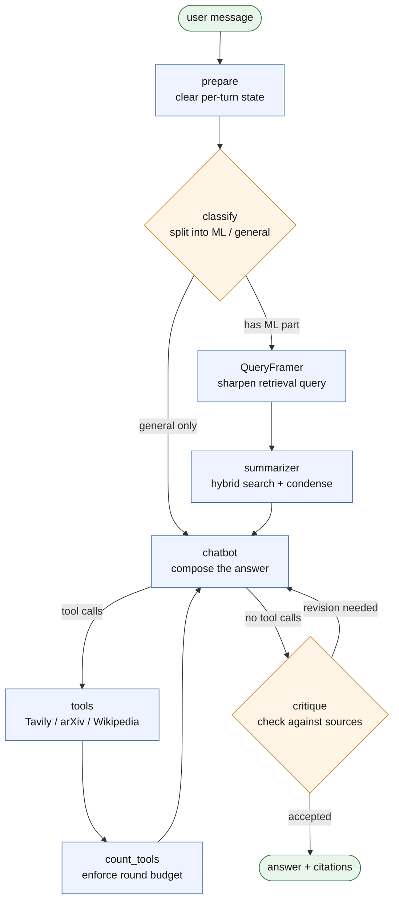
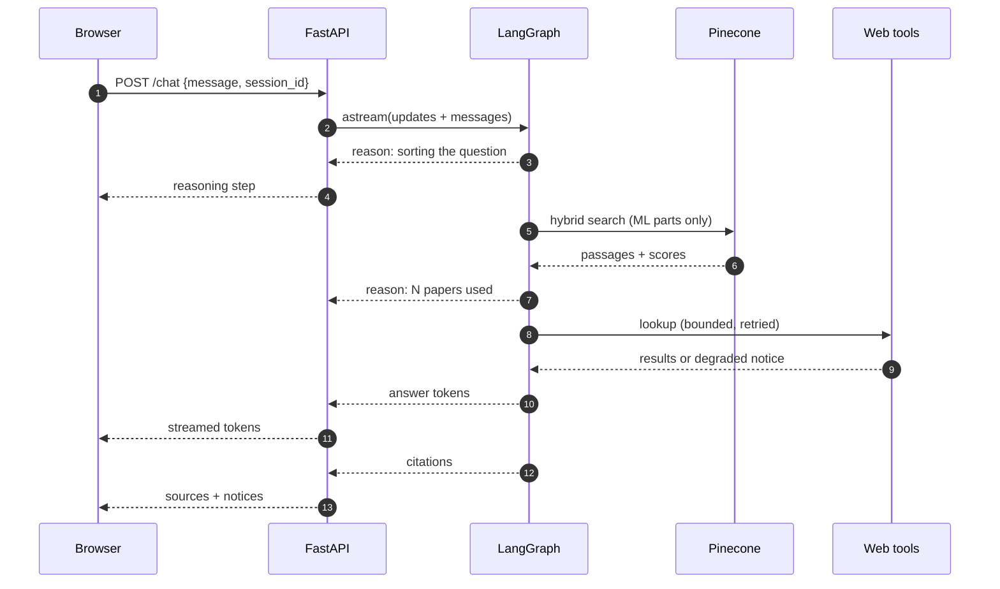
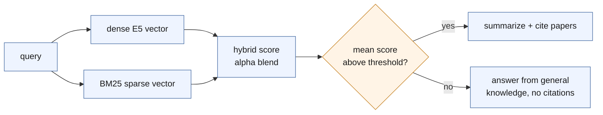

# AI Research RAG Assistant

[](https://www.python.org/)
[](https://langchain-ai.github.io/langgraph/)
[](https://www.pinecone.io/)
[](https://fastapi.tiangolo.com/)
[](https://nextjs.org/)
[](LICENSE)

A LangGraph agent for research questions in AI and machine learning. It combines
retrieval over a corpus of arXiv papers with query decomposition, context
summarization, self-critique and external search, served through a streaming
FastAPI backend and a Next.js chat interface.

---

## How it works

A question is not sent straight to a model. It moves through a stateful graph
that decides what kind of question it is, gathers evidence, and checks the
result before returning it.



| Step | What it does |
|---|---|
| **prepare** | Clears per-turn state so a follow-up never inherits the previous turn's context or citations. |
| **classify** | Splits the message into AI/ML parts and general parts. Only the ML parts shape the retrieval query. |
| **QueryFramer** | Rewrites the research half into a sharper search query; the answer still addresses what was asked. |
| **summarizer** | Hybrid search over Pinecone, then condenses the passages. Weak matches are discarded rather than cited. |
| **chatbot** | Composes the answer, with Tavily, arXiv and Wikipedia available as tools. |
| **critique** | Compares the answer against retrieved sources and can request one revision. |

### A single request



Questions outside AI/ML skip retrieval entirely and are answered normally,
searching the web when the answer is not already known rather than declining.

---

## Project structure

```
src/
  config.py       models, paths, budgets - all env-overridable
  embeddings.py   embedding model shared by indexing and retrieval
  agent/
    graph.py      the LangGraph graph and its nodes
    retriever.py  Pinecone hybrid retrieval
    tools.py      Tavily / arXiv / Wikipedia, bounded and retried
  api/main.py     FastAPI backend, newline-delimited JSON stream
web/              Next.js frontend (the UI)
  src/app/        routes, layout, global styles
  src/components/ chat, sidebar, composer, markdown renderer
  src/lib/        NDJSON stream reader, chat persistence, types
frontend/app.py   legacy Streamlit UI, kept as a fallback
scripts/
  scrape_arxiv.py fetch papers from arXiv
  build_index.py  build the Pinecone index
  healthcheck.py  verify keys, models, index and citations
tests/            regression tests, no framework required
data/             downloaded PDFs and extracted text
```

---

## Tech stack

| Layer | Choice |
|---|---|
| Orchestration | LangGraph, stateful graph with checkpointed memory |
| Models | Groq (`openai/gpt-oss-120b`, `openai/gpt-oss-20b` by default) |
| Vector store | Pinecone serverless, hybrid dense + sparse (`dotproduct`) |
| Embeddings | `intfloat/e5-large-v2` via Sentence-Transformers, computed locally |
| Sparse retrieval | BM25 fitted on the corpus |
| Backend | FastAPI, newline-delimited JSON streaming |
| Frontend | Next.js (App Router), React, Tailwind CSS, shadcn/ui |

---

## Getting started

### 1. Install dependencies

```bash
pip install -r requirements.txt
```

### 2. Set environment variables

Create a `.env` file in the project root:

```env
GROQ_API_KEY="your_groq_api_key"
PINECONE_API_KEY="your_pinecone_api_key"
TAVILY_API_KEY="your_tavily_api_key"
```

### 3. Build the vector index

```bash
python scripts/scrape_arxiv.py --query "machine learning" --count 20
python scripts/build_index.py --rebuild
```

`--rebuild` recreates the index from scratch; without it the script leaves a
populated index untouched.

### 4. Verify the setup

```bash
python scripts/healthcheck.py
```

Confirms your keys, that the configured Groq models are reachable, that the
index is populated, and that retrieval returns documents with citation metadata.

### 5. Run

Both servers together:

```bash
./scripts/dev.sh
```

Or separately, in two terminals:

```bash
uvicorn src.api.main:app --reload --port 8000
```

```bash
cd web && npm install && npm run dev
```

Then open <http://localhost:3000>. The frontend proxies `/api/*` to the backend,
so the browser never makes a cross-origin request; point it elsewhere with
`BACKEND_ORIGIN`.

<details>
<summary>Legacy Streamlit UI</summary>

The original Streamlit interface still works against the same backend:

```bash
streamlit run frontend/app.py
```

It is kept as a fallback and does not receive new features.
</details>

---

## Configuration

All settings live in `src/config.py` and can be overridden through `.env`.

| Variable | Default | Purpose |
|---|---|---|
| `GROQ_CHAT_MODEL` | `openai/gpt-oss-120b` | Main answering model |
| `GROQ_SUMMARY_MODEL` | `openai/gpt-oss-20b` | Summarization, routing, critique |
| `RETRIEVER_TOP_K` | `4` | Passages retrieved per query |
| `RETRIEVER_ALPHA` | `0.5` | Hybrid mix: `1.0` dense only, `0.0` sparse only |
| `RELEVANCE_MIN_SCORE` | `0.63` | Mean retrieval score required to use the corpus |
| `E5_USE_PREFIXES` | `true` | E5 `query:` / `passage:` prefixes |
| `MAX_HISTORY_CHARS` | `8000` | Conversation carried per request |
| `MAX_OUTPUT_TOKENS` | `1500` | Cap on answer length |
| `MAX_TOOL_ROUNDS` | `3` | Lookup rounds before a final answer is forced |
| `MAX_TOOL_RESULT_CHARS` | `3000` | Cap on a single tool result |
| `TOOL_TIMEOUT_SECONDS` | `8` | Per-attempt timeout for an external lookup |
| `TOOL_MAX_RETRIES` | `2` | Retries per lookup, exponential backoff |
| `TOOL_TOTAL_DEADLINE` | `12` | Ceiling on one lookup including retries |
| `TOOL_FREE_ATTEMPTS` | `3` | Retries when a model emits an unoffered tool call |
| `MAX_CRITIQUE_RETRIES` | `1` | Answer revisions allowed |
| `CRITIQUE_REQUIRES_CONTEXT` | `true` | Only review answers that have retrieved sources |

The current date is injected into the system prompt, so questions about today
or about what is recent are answered against the clock rather than the model's
training cutoff.

Groq's model lineup changes over time. To see what your key can reach:

```bash
curl -s -H "Authorization: Bearer $GROQ_API_KEY" https://api.groq.com/openai/v1/models
```

---

## Retrieval

Retrieval is hybrid: dense E5 vectors alongside a BM25 sparse encoder fitted on
your corpus and written to `bm25_values.json`. That file and the Pinecone index
are a matched pair, so regenerate them together.



Citations are only emitted when the retrieved papers actually informed the
answer. A question the corpus cannot answer falls back to general knowledge
rather than citing papers that do not support it.

`intfloat/e5-large-v2` is trained with asymmetric `query:` / `passage:` prefixes
and performs better with them, so they are enabled by default. Indexing and
querying must agree: if you change `E5_USE_PREFIXES`, rebuild the index in the
same setting.

---

## Interface

The frontend renders the stream as it arrives.

- **Reasoning** appears in a collapsible panel above each answer, with per-step
  timings. Collapsed, it shows the current step so progress stays visible.
- **Citations** render as chips under the answer, naming the papers used.
- **Maths** is typeset with KaTeX. Models emit `\(...\)` and `\[...\]`, which are
  rewritten to `$` and `$$`; the rewrite needs a closing delimiter, so an
  equation still arriving is left alone until it completes.
- **Wide tables** scroll horizontally rather than compressing cells.
- **Revisions** replace the draft in place when the critique step supersedes it.
- **Conversations** persist in `localStorage`, so a refresh keeps the transcript.
  Each chat maps to its own backend `session_id`; deleting one clears its
  history on the server too.
- **Stop** cancels an in-flight answer.

Dark and light themes are both supported, following the system preference by
default.

---

## Streaming protocol

`POST /chat` responds with newline-delimited JSON so reasoning, answer text and
metadata share one connection. Buffer until a newline before parsing; partial
chunks are expected.

| Event | Meaning |
|---|---|
| `{"type":"reason","text":...}` | Progress step, shown above the answer |
| `{"type":"token","text":...}` | Answer text |
| `{"type":"supersede"}` | Discard the answer so far; a revision follows |
| `{"type":"sources","items":[...]}` | Citations |
| `{"type":"notice","text":...}` | A capability degraded, such as search |
| `{"type":"error","text":...}` | Failure, reported in-band |

The UI shows reasoning steps in a collapsible panel above the answer, and
rewrites `\(...\)` and `\[...\]` maths to `$` and `$$` so it renders. The
rewrite requires a closing delimiter, so an equation still arriving mid-stream
is left untouched until it completes.

---

## Sessions

The sidebar keeps multiple chats. Each is a separate `session_id`, so switching
chats switches the server-side conversation memory too, not just the transcript
on screen. New chats take their title from the first message, and deleting a
chat clears its history on the backend.

Conversations are keyed by `session_id`, sent by the frontend and returned in
the `X-Session-Id` header. Callers with different ids have independent
histories; `POST /reset` clears one.

> Transcripts are stored in the browser's `localStorage` and survive a refresh.
> The server's own conversation state lives in LangGraph's in-process
> `MemorySaver`, so it resets when the backend restarts — after which a restored
> transcript is still readable, but the model no longer remembers it. For a
> long-running deployment, swap in a persistent checkpointer such as SQLite or
> Postgres in `src/agent/graph.py`.

---

## Reliability

External lookups are bounded in both attempts and wall-clock time, and the agent
degrades to its own knowledge rather than stalling when one is unavailable. The
reply carries a notice when that happens.

| Condition | Behaviour |
|---|---|
| Lookup times out | Bounded by `TOOL_TOTAL_DEADLINE`, then degrades with a notice |
| Lookup errors | Retried with backoff, then degrades with a notice |
| Lookup returns nothing | Reported as "no results", distinct from a failure |
| Model emits an unoffered tool call | Re-asked without tools, up to `TOOL_FREE_ATTEMPTS` |
| Model rate limited (429) | Retried on `GROQ_SUMMARY_MODEL`, with a notice |
| Provider refuses (401 / 403) | Stops immediately with an explanation |

A 403 from Groq is usually the network rather than the app: many VPN, proxy and
datacentre IP ranges are blocked. Check reachability with:

```bash
curl -s -o /dev/null -w "%{http_code}" https://api.groq.com/openai/v1/models
```

---

## Tests

```bash
python tests/test_reliability.py
```

Covers search timeout, search error and zero results; history trimming under
oversized tool payloads; the relevance gate; query splitting; recovery from
unoffered tool calls; query punctuation hygiene; and LaTeX including delimiters
split across stream chunks. No test framework required.

---

## Example queries

- What is reinforcement learning?
- Compare Q-learning with policy gradient methods
- Explain multi-agent coordination challenges, and who won the 2024 F1 championship?

---

## License

MIT. See [LICENSE](LICENSE).

---

## Design

[DESIGN.md](DESIGN.md) records why the system is built this way: the
constraints it works under, the decisions taken and the alternatives rejected.
Read it before changing retrieval, the token budget or the graph.

---

## Acknowledgements

Built with LangChain, LangGraph, Pinecone, Groq, Tavily, and open-access
research from arXiv.
